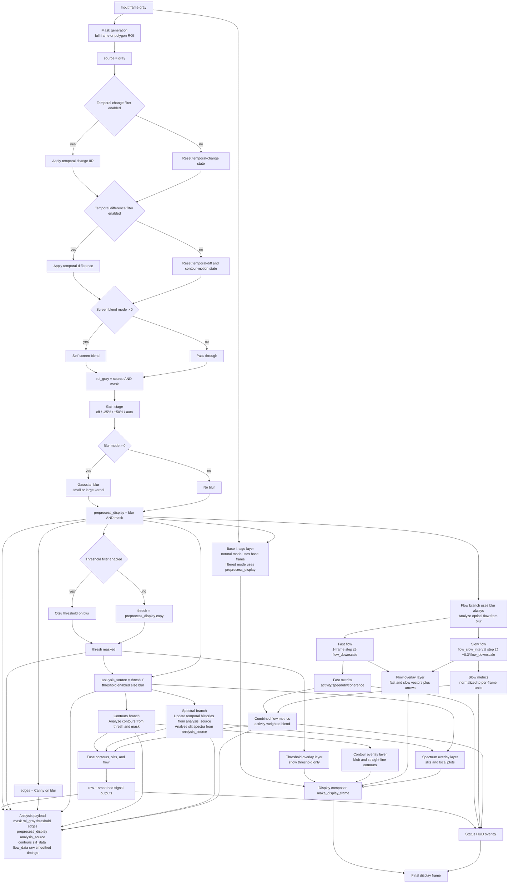

# Wave Analyzer Signal Flow

```mermaid
flowchart TD
    A[Input frame gray] --> B[Mask generation\nfull frame or polygon ROI]
    B --> C[source = gray]

    C --> D{Temporal change filter enabled}
    D -- yes --> D1[Apply temporal change IIR]
    D -- no --> D0[Reset temporal-change state]
    D1 --> E
    D0 --> E

    E{Temporal difference filter enabled}
    E -- yes --> E1[Apply temporal difference]
    E -- no --> E0[Reset temporal-diff and contour-motion state]
    E1 --> F
    E0 --> F

    F{Screen blend mode > 0}
    F -- yes --> F1[Self screen blend]
    F -- no --> F0[Pass through]
    F1 --> G
    F0 --> G

    G[roi_gray = source AND mask] --> H[Gain stage\noff / -25% / +50% / auto]
    H --> I{Blur mode > 0}
    I -- yes --> I1[Gaussian blur\nsmall or large kernel]
    I -- no --> I0[No blur]
    I1 --> J
    I0 --> J

    J[preprocess_display = blur AND mask] --> K{Threshold filter enabled}
    K -- yes --> K1[Otsu threshold on blur]
    K -- no --> K0[thresh = preprocess_display copy]
    K1 --> L
    K0 --> L

    J --> M[edges = Canny on blur]
    L[thresh masked] --> N
    J --> N

    N[analysis_source = thresh if threshold enabled else blur]

    N --> O[Contours branch\nAnalyze contours from thresh and mask]
    N --> P[Spectral branch\nUpdate temporal histories from analysis_source\nAnalyze slit spectra from analysis_source]
    J --> Q[Flow branch uses blur always\nAnalyze optical flow from blur]

    Q --> Q1[Fast flow\n1-frame step @ flow_downscale]
    Q --> Q2[Slow flow\nflow_slow_interval step @ ~0.3*flow_downscale]
    Q1 --> Q3[Fast metrics\nactivity/speed/dir/coherence]
    Q2 --> Q4[Slow metrics\nnormalized to per-frame units]
    Q3 --> Q5[Combined flow metrics\nactivity-weighted blend]
    Q4 --> Q5

    O --> R[Fuse contours, slits, and flow]
    P --> R
    Q5 --> R

    R --> S[raw + smoothed signal outputs]
    S --> T[Analysis payload\nmask roi_gray threshold edges\npreprocess_display analysis_source\ncontours slit_data flow_data raw smoothed timings]

    V[Display composer make_display_frame]
    V0[Base image layer\nnormal mode uses base frame\nfiltered mode uses preprocess_display]
    V1[Threshold overlay layer\nshow threshold only]
    V2[Contour overlay layer\nblob and straight-line contours]
    V3[Flow overlay layer\nfast and slow vectors plus arrows]
    V4[Spectrum overlay layer\nslits and local plots]
    U[Final display frame]
    U4[Status HUD overlay]

    A --> V0
    J --> V0
    L --> V1
    O --> V2
    Q1 --> V3
    Q2 --> V3
    P --> V4
    N --> V4
    S --> U4
    Q3 --> U4
    Q4 --> U4
    Q5 --> U4

    J --> T
    L --> T
    M --> T
    N --> T
    O --> T
    P --> T
    Q5 --> T

    V0 --> V
    V1 --> V
    V2 --> V
    V3 --> V
    V4 --> V
    V --> U
    U4 --> U
```
